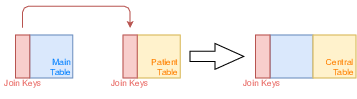
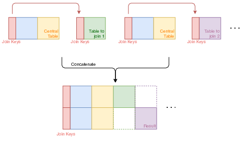
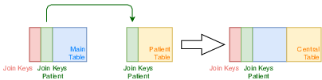
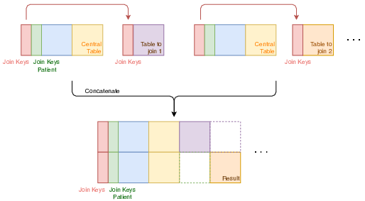

[](https://circleci.com/gh/X-DataInitiative/SCALPEL-Flattening)
[](https://codecov.io/gh/X-DataInitiative/SCALPEL-Flattening)
[](https://opensource.org/licenses/BSD-3-Clause)


## Three ways to flatten the data

There are several SNDS databases that we want to obtain through flattening.
These databases rely on different SNDS tables and therefore need different
manipulations. We built three types of flattening : the simplest is used to obtain the DCIR database
and the two others the different PMSI databases.

### The DCIR Flattening

This solution is the most straightforward. It consists in successive left outer joints on a main table on the same keys (fig 1.).
It's very well adapted when each line in the tables to be joined has at most one corresponding line in the main table. It suits to the construction of the DCIR database.

{:height="50%" width="50%"}

The result is a flattened table with one line for each line of the main table
with every columns of the main table plus the tables we joined to it (fig 2). Some of the lines can be partially or totally empty except for the main table variables.

<div style="text-align:center" title="fig. 2" ></div>

In the conf file you have to precise 4 parameters :

* **name**: the name of the flattened table;
* **join_keys**: set of keys for the joint;
* **main\_table_name**: the name of the main table;
* **tables\_to_join**: set of tables you want to join to the main table.

For example, this is our configuration for the DCIR :

```yaml
{
    name = "DCIR"
    join_keys = [
      "DCT_ORD_NUM"
      "FLX_DIS_DTD"
      "FLX_EMT_NUM"
      "FLX_EMT_ORD"
      "FLX_EMT_TYP"
      "FLX_TRT_DTD"
      "ORG_CLE_NUM"
      "PRS_ORD_NUM"
      "REM_TYP_AFF"
    ]
    main_table_name = "ER_PRS_F"
    tables_to_join = ["ER_PHA_F", "ER_UCD_F", "ER_ETE_F", "ER_CAM_F", "ER_BIO_F", "ER_TIP_F"]
}
```

## The PMSI Flattening

In the case of PMSI tables, the main table contains hospital stays and
the tables to join acts or information on these acts. Therefore we can have lines coming from several
affiliated tables for one hospital stay, thus multiple lines from multiples tables for each line
of the main table. One of the tables to join has also a specific status : the patient table.
It gathers information on the patient of the hospital stay. For this table, there
must be a one-to-one correspondence with the lines of the main table.

If we used successive joints like for the DCIR, it would result in a tremendous
cartesian product of all the lines of the input tables. It would take a very long time
and result in a huge flattened tables with redundant information. We had to design a new way to flatten the
PMSI tables.

The first step is the creation of a central table consisting of the left outer joint of the main table
and the patient table (fig. 3).

<div style="text-align:center" title="fig. 3" ></div>

Then we joint separately the other tables to the central table and concatenate the results (fig. 4). The result is a table with as many lines as the sum of all the lines of the tables to join and every columns of all the input tables. Only the information of the central
table is repeated (as many times as the number of tables to join). This non-redundancy results
in the presence of a lot of empty blocks (fig. 4). The flattened table can thus be obtained in a short time
and does use a reasonable amount of storage disk space.

<div style="text-align:center" title="fig. 4" ></div>

Compared to the first use-case, in the conf file, you have to precise one additional parameter :

* **pmsi\_patient\_table_name** : the name of the patient table.

If this parameter is present, the solution above will be used, otherwise it's the
first one which will be used.

For example, this is our configuration for the PMSI-MCO :

```yaml
{
    name = "MCO"
    join_keys = ["ETA_NUM", "RSA_NUM"]
    main_table_name = "MCO_B"
    pmsi_patient_table_name = "MCO_C"
    tables_to_join = ["MCO_A", "MCO_D", "MCO_UM", "MCO_MED", "MCO_MEDATU", "MCO_MEDTHROMBO"]
}
```

## The PMSI flattening with patient keys

In some cases, the joint for the construction of the central table requires different
keys than the following joints. We have to be careful to respect this supplementary constraint.

The first step now use a new set of keys (fig. 5).

<div style="text-align:center" title="fig. 5" ></div>

The following stay the same (fig. 6). And the result is quite the same (fig. 6).

<div style="text-align:center" title="fig. 6" ></div>

You have to add a new parameter if you want to use this method (the presence of this parameter
will determine if this method is used against the precedent one):

* **join\_keys_patient**: set of keys for the joint of main and patient tables.

For example, this is our configuration for the PMSI-SSR :

```yaml
{
    name = "SSR"
    join_keys_patient = ["ETA_NUM", "RHA_NUM"]
    join_keys = ["ETA_NUM", "RHA_NUM", "RHS_NUM"]
    pmsi_patient_table_name =  "SSR_C"
    main_table_name = "SSR_B"
    tables_to_join = ["SSR_CCAM", "SSR_D", "SSR_CSARR", "SSR_MED", "SSR_MEDATU"]
}
```
